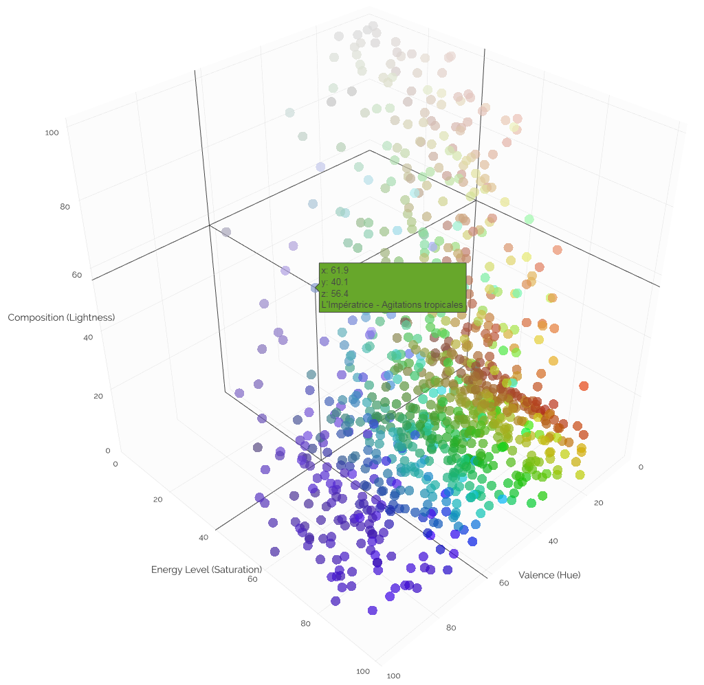

The goal of this project is to visualize musical qualities of songs in a playlist in a 3 dimensional space.
The most readily quantifiable qualities used here are valence (emotional tone), energy level, and composition (e.g. acousticness).
The colorsphere is a visual model with 3 dimensions of visual information (hue, saturation, and lightness), on to which the musical qualities can be mapped.
 
Here valence is represented by hue, energy level by saturation, and composition by lightness.

The musical qualities are obtained from the Echo Nest/Spotify API, and plotted with Dash by Plot.ly.

The API's audio features endpoint returns scores for many valuables tags of a track, including: danceability,
energy, key, loudness, mode, speechiness, acousticness, instrumentalness, liveness, valence, tempo and time signature. 

Special thanks to <a href="https://github.com/mari-linhares/spotify-flask">Marianne Linhares</a> for 
work developing towards a Flask interface for the Spotify API.